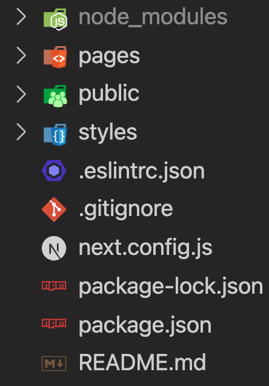

## 넥스트 JS 배워보기

예전부터 꼭 배워보고 싶은 Next JS 프레임워크에 드디어 입문했다. 여태까지 관리자 페이지나 랜딩페이지를 만들다 보니 CSR(Client Side Rendering)으로 충분했지만 곧 있으면 검색이 원할하게 이루어져야하는 프로젝트에 투입 될거같아 SSR을 지원하는 넥스트JS를 배우려고한다.

React 자체적으로도 SSR (서버 사이드 렌더링)이 가능하긴하지만 생각보다 복잡하기 때문에 넥스트 JS는 꼭 배워두면 좋겠다고 생각했었다.

SSR이외에도 코드 분활 (Code Splitting), 라우팅 (Automatic Routing)등이 대표적인 장점이라고 한다. 대충 감은 오지만 정확한건 직접 간단한 프로젝트를 진행하면서 이해해보려고 한다.

기본적으로 Node JS와 npm 또는 yarn이 설치되어있다는 가정하에
CLI 툴을 통해 손쉽게 next 앱을 만들수 있다.

```
  npx create-next-app
  # 또는
  yarn create-next-app
```

조금 기다려보면 아래와 같이 폴더가 세팅되어있다.



사실 `npx create-react-app`을 통해 만든 리액트 앱이랑 큰 차이는 없어보인다. next app이 더 가벼운정도?

♦ .next

- build/배포시 필요한 파일들이 담겨있는 폴더

♦ components

- 재활용 가능한 제일 작은 단위의 컴포넌트
- 필요시 containers, layout등 더 큰단위의 컴포넌트들로 세분화 시킴

♦ pages

- 넥스트앱이랑 리액트앱의 가장 큰 차이인것 같다. 넥스트 js는 라우트를 내장하고 있기 때문에 pages에 파일을 생성하게되면 그 파일명이 라우트가 된다. 이게 아까 언급했던 Automatic Routing인것 같다. 더 자세한것 프로젝트를 진행하면서 다뤄보겠다.

  ✔︎ index.js
  브라우저에 랜더링 되어야할 내용들이 적히는곳

  ✔︎ \_app.js

  - 메인 엔트리 포인트 (앱내에 공통적으로 적용될 레이아웃이 있다면 여기에)

  ✔︎ api

  - 앱내에 반복적으로 사용될 api들

♦ styles

- 스타일 관련 (css)

♦ next.config.js

- next js 환경 설정 파일 (sass 모듈 등 설정)

---

공식문서와 여러 블로그를 읽어보면서 데이터를 불러오는 방식에서 큰 차이가 있음을 느꼈고 자세히 알아보기위해 진부하지만 연습용으로 JSON placeholder API를 사용해 포스트를 가져오는 작업을 진행해보았다.

보통 CSR을 했다면 아래와 같이 불러왔을거다.

```javascript
//...생략
const [posts, setPosts] = useState([]);
useEffect(() => {
  const fetchData = async () => {
    const res = await fetch("https://jsonplaceholder.typicode.com/posts");
    const posts = await res.json();
    setPosts(posts);
  };
  fetchData();
}, []);
// ...생략
```

위 방법의 문제점 (CSR의 문제점) 은 Pre-rendering을 지원하지 않는다는것이다. 초기에 빈 html이 있고 JS가 로드 된 이후에야 컨텐츠가 보이는 식이다. 하지만 Next JS를 사용하게 되면 Pre-Rendering을 통해 미리 생성된 HTML을 표시하기 때문에 초기 로딩이 빠르고 빌드시 정보가 HTML에 내포 되있기 때문에 검색엔진에 잘 노출이 될수 있는것이다.

SSR의 최대 장점인 Pre-Rendering은 Next JS를 통해서 생각외로 간단히 적용가능하다.

### Pre-Rendering

공식문서에 따르면 두가지의 Pre-rendering 방법(Static Generation , Server Side Rendering)을 사용할수 있는데 두 방법의 차이는 HTML이 **만들어지는 시점**에 있다. 꼭 한가지 방법을 채택해야하는건 아니고 상황에 맞게 한가지를 선택해 적용하던가 두가지를 조합해서 사용하던가 하면 된다.

##### Static Generation (추천)

빌드시에 HTML이 만들어지고 요청이 일어나면 처음 만들어진 HTML을 재활용함. 내가 추천하는건 아니고 공식문서에서 추천한다고 한다...

외부 데이터 불러올시, 아래와 같이`getStaticProps`을 통해 pre-rendering을 해줬다. 자세한 내용은 pages 폴더의 index.js 참고.

```javascript
// ... 생략
export const getStaticProps = async () => {
  const res = await fetch("https://jsonplaceholder.typicode.com/posts");
  const posts = await res.json();

  return {
    props: {
      posts,
    },
    revalidate: 20, // 20초후에 페이지를 다시 만들도록 설정할수도 있다 (기본 false)
  };
};
// ... 생략
```

추가적으로 path가 외부 데이터에 의존한다면 `getStaticPath`을 써주도록 하자.

예를들어 여러개에 사진이 있고 그걸 클릭하면 사진에 대한 세부정보를 볼수 있게하려면 id값으로 Dynamic(Automatic) Routing이 되도록하면 된다.

초반에 언급했듯이 Automatic Routing은 Next Js의 장점중 하나인데,

페이지에 `[param]` 형식으로 라우트를 간단히 설정할수 있다.


이런식으로 구조를 잡게 되면 `photos/1`, `photos/32` 각각 1, 32 쿼리 객체를 갖게 된다.

특정 id값에 대한 사진 정보를 Pre-render하고싶은지는 외부 데이터에 따라 다르기 때문에 앞서 언급한 `getStaticPath`를 써줘야한다.

아래는 10개의 (id 0-10)의 사진 정보를 `getStaticPath`를 통해 pre-rendering하는 과정이다.

이런식으로 각 사진에 대한 정보를 pre-rendering하게 되면 각각의 사진에 대한 검색 최적화가 가능하다. 인터넷 쇼핑몰에서 각 제품에 대한 정보들이 잘 노출될수 있는 이유도 이런식으로 다 SSR 방식을 쓰기 때문인것같다.

```javascript
// ...자세한 내용은 `photos/[id]/index.js` 참고.
export const getStaticPaths = async () => {
  const res = await fetch(
    "https://jsonplaceholder.typicode.com/photos?_start=0&_end=10"
  );
  const photos = await res.json();
  const ids = photos.map((photo) => photo.id);
  const paths = ids.map((id) => {
    return {
      params: { id: id.toString() },
    };
  });
  return {
    paths,
    fallback: false, // 해당 함수로 return 되지 않는 path에 대한 요청은 404페이지로 응답
  };
};
// ...생략
```

지금은 10개의 데이터만 불러왔기때문에 상관이없지만 만약 데이터가 수천개가 넘어간다면 빌드시에 모든 페이지를 생성하는건 무리일수 있다. 이때 필요한게 `fallback` 옵션인데 `false`, `true`, `blocking`, 이렇게 3가지 값을 줄수있다. `false`로 설정되있으면 build 타임에 생성하지 않는 path로 요청이 들어오면 404페이지를 보여주고 `true`일시에는 몇몇 페이지만 정적으로 생성후, 요청이 오는거에 따라 fallback 페이지를 보여준후 백그라운드에서 정적 페이지를 추가할수 있다 (빌드, 응답 속도 단축가능).
`blocking`은 `true`와 유사하게 작동하지만 생성되지 않은 path에 대한 요청이 들어올시 fallback 페이지를 따로 보여주지 않고 그냥 SSR이 작동하는 방식처럼 작동한다.

##### Server-Side Rendering

요청마다 새로운 HTML 생성.
아래 함수는 페이지 요청마다 계속 반복적으로 실행되기 때문에 업데이트 된 정보를 수시로 확인가능하다.

```javascript
// ...생략 index.js참조
export const getServerSideProps = async () => {
  const res = await fetch("http://localhost:8080/api/posts");
  const posts = await res.json();

  return {
    props: {
      posts,
    },
  };
};
```

#### NextJS 관련 프로젝트

- 트위터 클론
